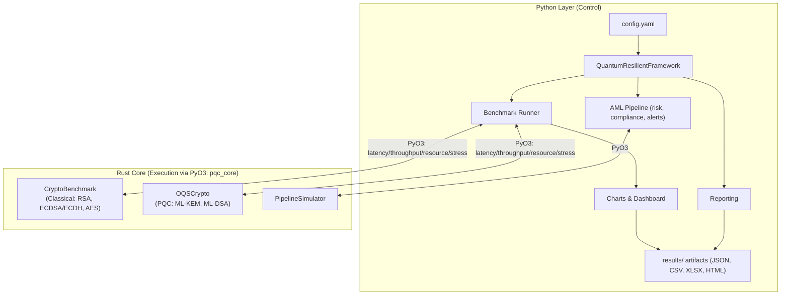
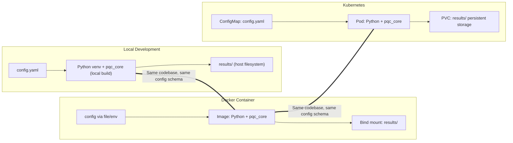

## Prototype Implementation and Logical Architecture

This page describes the prototype implementation of the Quantum‑Resilient framework in a way suitable for the main body of the dissertation, with a concise logical diagram, followed by an appendix‑oriented technical section for full reproducibility. It aligns the prototype to Objective 2 and shows how it enables Objectives 3–5.

## High‑level implementation (for main dissertation)

The framework implements a hybrid design: a high‑performance Rust core exposed to Python via PyO3, orchestrated by a Python research layer that runs experiments, real‑world AML simulations, and reporting.

- **Core components**
  - **Rust core (`src/rust_core`, module `pqc_core`)**: Implements simulated cryptographic operations, system metrics, and pipeline simulation primitives with deterministic latency/throughput characteristics for both classical and NIST‑standardized PQC families (ML‑KEM, ML‑DSA).
  - **Python orchestrator (`src/python_orchestrator`)**: Coordinates experiments and analyses via `QuantumResilientFramework` and `ComprehensiveBenchmarker`; loads configuration from `config.yaml`, runs benchmarks, produces artifacts in `results/`.
  - **Real‑world AML integration (`src/real_world`)**: Simulates transaction processing, risk assessment, and compliance checks; measures crypto overhead and end‑to‑end latency to validate real‑world applicability.
  - **Reporting (`src/reporting`)**: Generates structured JSON and succinct Markdown summaries for dissertation inclusion and appendices.

- **Objective mapping**
  - **Objective 2 (Prototype framework)**: A modular, configuration‑driven framework with clear interfaces allows plug‑and‑play algorithms and repeatable experiments. The PyO3 boundary makes the high‑performance core usable across environments without re‑writing research logic.
  - **Enabling Objective 3 (Benchmarking)**: The orchestrator drives comprehensive latency, throughput, resource, and stress tests over classical and PQC algorithms; the Rust core provides consistent timing and system metrics; results are saved with ready‑to‑use visualizations.
  - **Enabling Objective 4 (Comparison)**: Shared data structures and result schemas let us compute PQC vs classical overheads and statistical significance uniformly, ensuring like‑for‑like comparisons across data sizes and operations.
  - **Supporting Objective 5 (Recommendations)**: Aggregated metrics and reporting templates synthesize findings into practical guidance for migration pathways and performance envelopes.

## Logical architecture diagram (for main dissertation)

The diagram shows only the components and interactions necessary to understand how the prototype achieves Objective 2 and enables Objectives 3–5.

## Technical appendix: Reproducibility notes

This section can be placed in an appendix for readers who wish to re‑run or extend the prototype.

- **Prerequisites**
  - Python 3.11+
  - Rust toolchain (stable), `cargo`
  - Optional: `maturin` for local PyO3 builds (`pip install maturin`)

- **Build the Rust PyO3 module**
  - Source: `src/rust_core` (`Cargo.toml` name: `pqc_core`, type: `cdylib`)
  - Typical options:
    - Quick local: `cargo build --release` (copy the built `.so`/`.pyd` to a directory on `PYTHONPATH` so Python can import `pqc_core`).
    - Editable install: `maturin develop --release` (builds and installs `pqc_core` into the active virtualenv).
  - The Python layer automatically falls back to mock implementations if `pqc_core` is unavailable, enabling development without native builds.

- **Run end‑to‑end experiments**
  - Full run (Objectives 3 & 4): `python src/python_orchestrator/main.py run`
  - Benchmark only (Obj. 3): `python src/python_orchestrator/main.py benchmark`
  - Comparison only (Obj. 4): `python src/python_orchestrator/main.py compare`
  - One‑step wrapper: `python run_benchmarks.py`
  - Outputs are written to `results/` (JSON/CSV/XLSX, static charts, interactive HTML dashboard).

- **Configuration**
  - Controlled via `config.yaml` (algorithms, data sizes, iterations, concurrency, output directory).
  - Add algorithms by updating `algorithms.classical` or `algorithms.pqc`; the orchestrator will initialize corresponding `CryptoBenchmark`/`OQSCrypto` instances.

- **Key extension points**
  - Add metrics/charts in `src/python_orchestrator/benchmarking.py` (`ComprehensiveBenchmarker`).
  - Extend AML realism in `src/real_world/aml_pipeline.py` (risk indicators, compliance checks).
  - Customize report content in `src/reporting/research_reporter.py`.

Refer to `docs/ARCHITECTURE.md` for deeper architectural details and `docs/benchmarking.md` for the benchmarking methodology and outputs.

## Environment model and portability

The same codebase runs locally, in Docker, and on Kubernetes without change; only configuration and persistence differ.

- **Local**: Build `pqc_core` with Cargo or `maturin` and run orchestrator scripts directly; artifacts land in the working directory.
- **Docker**: Use the provided `docker/Dockerfile` and `docker-compose.yml`; mount `results/` for artifacts and pass `config.yaml` in.
- **Kubernetes**: Use `k8s/deployment.yaml` with a `ConfigMap` for configuration and a `PersistentVolumeClaim` for `results/`; scale via replicas/limits.

This portability, enabled by the Objective‑2 modular architecture, directly supports repeatable benchmarking (Objective 3), robust comparison studies (Objective 4), and production‑oriented guidance (Objective 5).

