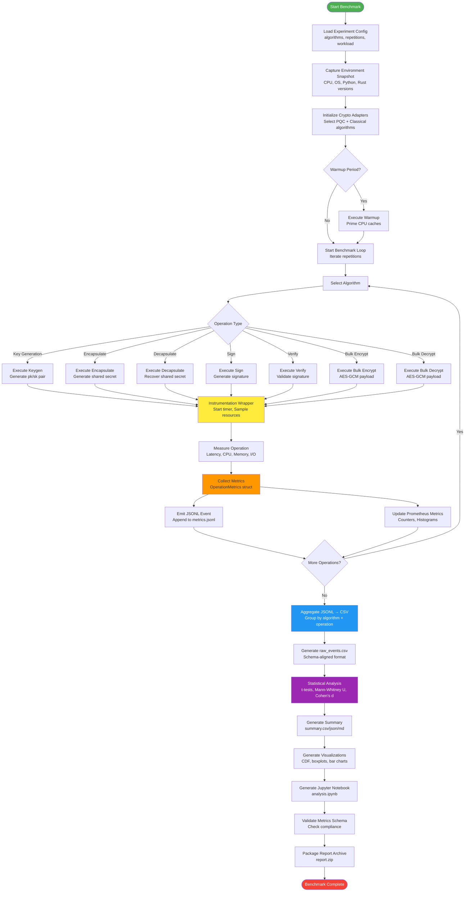
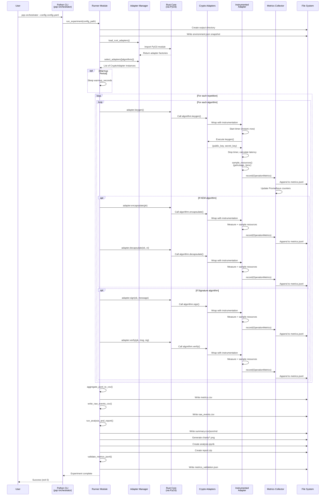
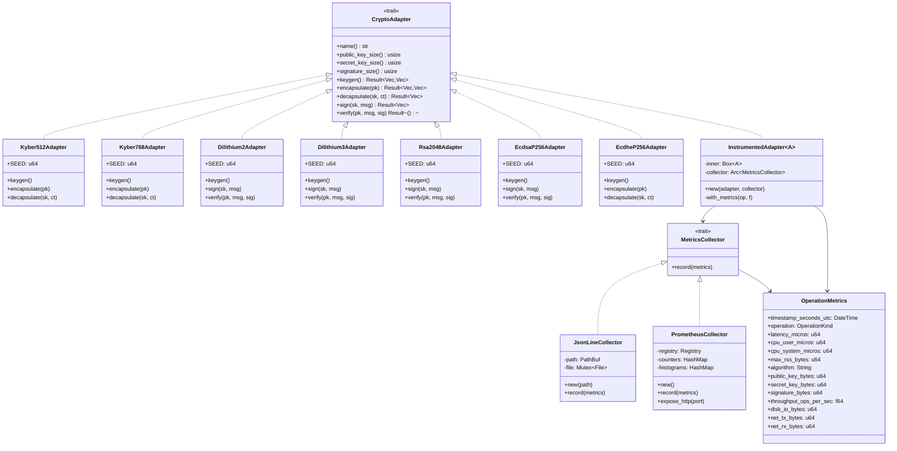

# Framework Implementation Diagrams

This document provides detailed architectural and implementation diagrams for the Post-Quantum Cryptography (PQC) Performance Benchmarking Framework.

## Table of Contents
1. [System Architecture](#system-architecture)
2. [Data Flow Architecture](#data-flow-architecture)
3. [Experimental Workflow](#experimental-workflow)
4. [Component Interaction](#component-interaction)
5. [Deployment Architecture](#deployment-architecture)
6. [Algorithm Adapter Pattern](#algorithm-adapter-pattern)
7. [Metrics Collection Pipeline](#metrics-collection-pipeline)

---

## System Architecture

This diagram shows the overall system structure, including the Rust core, Python orchestrator, and their interactions.

```mermaid
graph TB
    subgraph "User Interface"
        CLI[CLI Entry Point<br/>pqc-orchestrator]
        CONFIG[Experiment Config<br/>YAML]
        SCHEMA[Schema Definitions<br/>metrics_schema.yaml<br/>experiment_schema.yaml]
    end

    subgraph "Python Orchestrator Layer"
        RUNNER[Runner Module<br/>Experiment Execution]
        CFGLOAD[Config Loader<br/>YAML Parsing]
        ADAPTER[Adapter Manager<br/>PyO3 Bindings]
        METRICS_PY[Metrics Aggregator<br/>JSONL → CSV]
        ANALYSIS[Analysis Engine<br/>Statistical Tests]
        REPORT[Reporting Module<br/>Charts + Notebook + Report]
        VALIDATE[Schema Validator<br/>Metrics Validation]
        ENV[Environment Snapshot<br/>System State Capture]
    end

    subgraph "Rust Core Library"
        subgraph "Public API (PyO3)"
            PYO3[PyO3 Module<br/>Python Bindings]
        end
        
        subgraph "Cryptographic Adapters"
            TRAIT[CryptoAdapter Trait<br/>Common Interface]
            KYBER512[Kyber512<br/>NIST Level 1 KEM]
            KYBER768[Kyber768<br/>NIST Level 3 KEM]
            DIL2[Dilithium2<br/>NIST Level 2 Signature]
            DIL3[Dilithium3<br/>NIST Level 3 Signature]
            RSA[RSA-2048<br/>Classical PKI]
            ECDSA[ECDSA-P256<br/>Classical Signature]
            ECDHE[ECDHE-P256<br/>Classical Key Exchange]
            AES[AES-GCM-256<br/>Symmetric Baseline]
        end
        
        subgraph "Instrumentation Layer"
            INSTR[InstrumentedAdapter<br/>Metrics Wrapper]
            RESOURCE[Resource Sampler<br/>CPU/Memory/IO]
        end
        
        subgraph "Workload Engine"
            WORK[Workload Generator<br/>Deterministic Seeds]
            MODES[Execution Modes<br/>Streaming/Handshake]
            BACKP[Backpressure Handler<br/>Block/Drop]
        end
        
        subgraph "Metrics Collectors"
            JSONL[JSONL Writer<br/>File Sink]
            PROM[Prometheus Exporter<br/>HTTP Endpoint]
        end
    end

    subgraph "Output Artifacts"
        OUT_JSONL[metrics.jsonl<br/>Raw Events]
        OUT_CSV[metrics.csv<br/>Aggregated Data]
        OUT_RAW[raw_events.csv<br/>Schema-Aligned]
        OUT_SUM[summary.csv/json/md<br/>Statistical Summary]
        OUT_CHARTS[charts/<br/>PNG Visualizations]
        OUT_NB[analysis.ipynb<br/>Jupyter Notebook]
        OUT_ZIP[report.zip<br/>Complete Archive]
        OUT_ENV[environment.json<br/>System Snapshot]
        OUT_VALID[metrics_validation.json<br/>Schema Compliance]
    end

    %% Connections
    CLI --> CONFIG
    CLI --> RUNNER
    CONFIG --> CFGLOAD
    SCHEMA --> VALIDATE
    
    CFGLOAD --> RUNNER
    RUNNER --> ADAPTER
    RUNNER --> ENV
    RUNNER --> METRICS_PY
    RUNNER --> ANALYSIS
    RUNNER --> REPORT
    RUNNER --> VALIDATE
    
    ADAPTER --> PYO3
    PYO3 --> TRAIT
    
    TRAIT --> KYBER512
    TRAIT --> KYBER768
    TRAIT --> DIL2
    TRAIT --> DIL3
    TRAIT --> RSA
    TRAIT --> ECDSA
    TRAIT --> ECDHE
    TRAIT --> AES
    
    KYBER512 --> INSTR
    KYBER768 --> INSTR
    DIL2 --> INSTR
    DIL3 --> INSTR
    RSA --> INSTR
    ECDSA --> INSTR
    ECDHE --> INSTR
    AES --> INSTR
    
    INSTR --> RESOURCE
    INSTR --> WORK
    WORK --> MODES
    WORK --> BACKP
    
    INSTR --> JSONL
    INSTR --> PROM
    
    JSONL --> OUT_JSONL
    OUT_JSONL --> METRICS_PY
    
    METRICS_PY --> OUT_CSV
    METRICS_PY --> OUT_RAW
    ANALYSIS --> OUT_SUM
    REPORT --> OUT_CHARTS
    REPORT --> OUT_NB
    REPORT --> OUT_ZIP
    ENV --> OUT_ENV
    VALIDATE --> OUT_VALID
    
    style CLI fill:#e1f5ff
    style RUNNER fill:#fff3e0
    style PYO3 fill:#f3e5f5
    style TRAIT fill:#e8f5e9
    style INSTR fill:#fff9c4
    style JSONL fill:#ffebee
```



---

## Data Flow Architecture

This diagram illustrates how data flows through the benchmarking pipeline from configuration to final outputs.



---

## Experimental Workflow

This diagram shows the detailed step-by-step execution flow during a benchmark run.



---

## Component Interaction

This diagram shows how different modules interact during the execution lifecycle.

```mermaid
graph TB
    subgraph "Configuration & Initialization"
        YAML[Experiment Config<br/>default.yaml]
        LOADER[config_loader.py<br/>load_experiment_config]
        ENV_SNAP[env_snapshot.py<br/>write_snapshot_json]
    end
    
    subgraph "Adapter Management"
        ADAPT_MGR[adapters.py<br/>load_rust_adapters<br/>select_adapters]
        PYO3_BIND[Rust PyO3 Module<br/>pyo3_mod.rs<br/>@pymodule pqc_core]
    end
    
    subgraph "Rust Core Execution"
        CRYPTO_TRAIT[lib.rs<br/>CryptoAdapter trait<br/>InstrumentedAdapter]
        
        subgraph "Algorithm Implementations"
            KYBER[kyber512.rs<br/>kyber768.rs]
            DILITH[dilithium2.rs<br/>dilithium3.rs]
            CLASSIC[rsa2048.rs<br/>ecdsa_p256.rs<br/>ecdhe_p256.rs]
        end
        
        WORKLOAD[workload.rs<br/>Deterministic seeds<br/>ChaCha20 RNG]
        MODES[modes.rs<br/>Streaming mode<br/>Handshake mode]
        RESOURCE[lib.rs<br/>sample_resources()<br/>getrusage, /proc/*]
    end
    
    subgraph "Metrics Pipeline"
        JSONL_COL[metrics.rs<br/>JsonLineCollector<br/>Write to file]
        PROM_COL[metrics.rs<br/>PrometheusCollector<br/>HTTP :9100/metrics]
        STRUCT[OperationMetrics<br/>timestamp, latency,<br/>cpu, memory, io]
    end
    
    subgraph "Data Processing"
        AGG[metrics.py<br/>aggregate_jsonl_to_csv<br/>GroupBy algorithm+op]
        RAW_CSV[metrics.py<br/>write_raw_events_csv<br/>Schema-aligned]
    end
    
    subgraph "Statistical Analysis"
        STATS[statistical_tests.py<br/>t-test, Mann-Whitney U<br/>Cohen's d, CI]
        ANALYSIS[analysis.py<br/>load_metrics<br/>compute_statistics]
    end
    
    subgraph "Reporting"
        REPORT[reporting.py<br/>run_analysis_and_report]
        CHARTS[matplotlib/seaborn<br/>CDF, boxplot, bar]
        NOTEBOOK[Jupyter notebook<br/>analysis.ipynb]
        ARCHIVE[report.zip<br/>All artifacts]
    end
    
    subgraph "Validation"
        SCHEMA_VAL[schema_validate.py<br/>validate_metrics_jsonl<br/>Check compliance]
        METRICS_SCHEMA[metrics_schema.yaml<br/>Field definitions]
    end
    
    %% Flow connections
    YAML --> LOADER
    LOADER --> ENV_SNAP
    LOADER --> ADAPT_MGR
    
    ADAPT_MGR --> PYO3_BIND
    PYO3_BIND --> CRYPTO_TRAIT
    
    CRYPTO_TRAIT --> KYBER
    CRYPTO_TRAIT --> DILITH
    CRYPTO_TRAIT --> CLASSIC
    
    KYBER --> WORKLOAD
    DILITH --> WORKLOAD
    CLASSIC --> WORKLOAD
    
    WORKLOAD --> MODES
    WORKLOAD --> RESOURCE
    
    CRYPTO_TRAIT --> STRUCT
    RESOURCE --> STRUCT
    
    STRUCT --> JSONL_COL
    STRUCT --> PROM_COL
    
    JSONL_COL --> AGG
    JSONL_COL --> RAW_CSV
    
    AGG --> STATS
    RAW_CSV --> STATS
    STATS --> ANALYSIS
    
    ANALYSIS --> REPORT
    REPORT --> CHARTS
    REPORT --> NOTEBOOK
    REPORT --> ARCHIVE
    
    JSONL_COL --> SCHEMA_VAL
    METRICS_SCHEMA --> SCHEMA_VAL
    
    style CRYPTO_TRAIT fill:#e8f5e9
    style STRUCT fill:#fff9c4
    style STATS fill:#e1bee7
    style REPORT fill:#bbdefb
```

---

## Deployment Architecture

This diagram shows the different deployment options: local direct, Docker Compose, Kubernetes, and GCP GKE.

```mermaid
graph TB
    subgraph "Deployment Options"
        OPT1[Option 1:<br/>Local Direct]
        OPT2[Option 2:<br/>Docker Compose]
        OPT3[Option 3:<br/>Local Kubernetes<br/>minikube/podman]
        OPT4[Option 4:<br/>GCP GKE<br/>Cloud deployment]
    end
    
    subgraph "Local Direct Execution"
        LOCAL_RUST[Cargo build --release<br/>Rust core binary]
        LOCAL_PY[pip install -e .<br/>Python orchestrator]
        LOCAL_RUN[pqc-orchestrator<br/>--config config.yaml]
        LOCAL_OUT[./results/<br/>Local output]
    end
    
    subgraph "Docker Compose Environment"
        COMPOSE[docker-compose.yml]
        
        subgraph "Containers"
            RUST_CONT[pqc-rust-core<br/>Rust core service<br/>Port 9100]
            ORCH_CONT[pqc-orchestrator<br/>Python runner<br/>Volume mount]
            PROM_CONT[prometheus<br/>Metrics scraper<br/>Port 9090]
        end
        
        VOL[Volume: ./results]
    end
    
    subgraph "Kubernetes Deployment"
        K8S_NS[Namespace:<br/>pqc-benchmark]
        
        subgraph "K8s Resources"
            K8S_DEPLOY[Deployment<br/>pqc-benchmark-rust-core<br/>replicas: 1]
            K8S_SVC[Service<br/>pqc-benchmark-rust-core<br/>Type: ClusterIP<br/>Port 9100]
            K8S_JOB[Job<br/>pqc-orchestrator<br/>restartPolicy: OnFailure]
            K8S_PVC[PersistentVolumeClaim<br/>pqc-results-pvc<br/>ReadWriteMany]
        end
        
        K8S_SCRIPTS[run_local_k8s.sh<br/>kubectl apply<br/>Copy results]
    end
    
    subgraph "GCP Cloud Deployment"
        TERRA[Terraform<br/>terraform/gcp/]
        
        subgraph "GCP Resources"
            GKE[GKE Cluster<br/>pqc-benchmark<br/>Auto-scaling]
            GCS[GCS Bucket<br/>gs://bucket/results/<br/>Output storage]
            SA[Service Account<br/>IAM roles<br/>Storage Admin]
            NET[VPC Network<br/>Private cluster]
        end
        
        HELM[Helm Chart<br/>helm/]
        GCP_SCRIPTS[run_gcp.sh<br/>Provision, deploy, download]
    end
    
    %% Connections
    OPT1 --> LOCAL_RUST
    OPT1 --> LOCAL_PY
    LOCAL_RUST --> LOCAL_RUN
    LOCAL_PY --> LOCAL_RUN
    LOCAL_RUN --> LOCAL_OUT
    
    OPT2 --> COMPOSE
    COMPOSE --> RUST_CONT
    COMPOSE --> ORCH_CONT
    COMPOSE --> PROM_CONT
    RUST_CONT --> VOL
    ORCH_CONT --> VOL
    
    OPT3 --> K8S_NS
    K8S_NS --> K8S_DEPLOY
    K8S_NS --> K8S_SVC
    K8S_NS --> K8S_JOB
    K8S_NS --> K8S_PVC
    K8S_SCRIPTS --> K8S_NS
    K8S_JOB --> K8S_PVC
    
    OPT4 --> TERRA
    TERRA --> GKE
    TERRA --> GCS
    TERRA --> SA
    TERRA --> NET
    HELM --> GKE
    GCP_SCRIPTS --> TERRA
    GCP_SCRIPTS --> HELM
    GKE --> GCS
    
    style OPT1 fill:#c8e6c9
    style OPT2 fill:#bbdefb
    style OPT3 fill:#f0f4c3
    style OPT4 fill:#ffccbc
```



---

## Algorithm Adapter Pattern

This diagram illustrates the adapter pattern used for cryptographic algorithm implementations.



---

## Metrics Collection Pipeline

This diagram shows the detailed metrics collection and processing pipeline.

```mermaid
flowchart TB
    START[Cryptographic Operation<br/>Executed] --> WRAP{Instrumented?}
    
    WRAP -->|Yes| TIMER_START[Start Timer<br/>Instant::now]
    WRAP -->|No| EXEC_DIRECT[Execute Directly<br/>No metrics]
    
    TIMER_START --> EXEC[Execute Operation<br/>keygen/sign/encapsulate/etc]
    
    EXEC --> TIMER_STOP[Stop Timer<br/>Calculate latency_micros]
    
    TIMER_STOP --> SAMPLE[Sample System Resources<br/>getrusage RUSAGE_SELF]
    
    SAMPLE --> CPU[Extract CPU Time<br/>ru_utime.tv_sec/tv_usec<br/>ru_stime.tv_sec/tv_usec]
    
    CPU --> MEM[Extract Memory<br/>ru_maxrss * 1024 bytes]
    
    MEM --> PROC_IO{Linux System?}
    
    PROC_IO -->|Yes| READ_IO[Read /proc/self/io<br/>read_bytes + write_bytes]
    PROC_IO -->|No| SKIP_IO[Skip disk I/O]
    
    READ_IO --> PROC_NET
    SKIP_IO --> PROC_NET
    
    PROC_NET{Linux System?}
    PROC_NET -->|Yes| READ_NET[Read /proc/net/dev<br/>Sum rx_bytes, tx_bytes]
    PROC_NET -->|No| SKIP_NET[Skip network I/O]
    
    READ_NET --> BUILD
    SKIP_NET --> BUILD
    
    BUILD[Build OperationMetrics<br/>Populate all fields] --> CALC[Calculate Derived Metrics<br/>throughput = 1M / latency_us<br/>avg_memory_mb = rss / 1024^2]
    
    CALC --> ANNOTATE[Add Algorithm Metadata<br/>name, key sizes, signature size]
    
    ANNOTATE --> DISPATCH[Dispatch to Collectors<br/>collector.record]
    
    subgraph "Collector: JSONL"
        JSONL_RECV[Receive OperationMetrics]
        JSONL_SERIAL[Serialize to JSON<br/>serde_json::to_string]
        JSONL_LOCK[Lock file handle<br/>Mutex]
        JSONL_WRITE[Write line + newline]
        JSONL_FLUSH[Flush to disk]
    end
    
    subgraph "Collector: Prometheus"
        PROM_RECV[Receive OperationMetrics]
        PROM_COUNT[Increment Counter<br/>operation_total by algorithm]
        PROM_HIST[Record Histogram<br/>operation_latency_micros]
        PROM_GAUGE[Update Gauge<br/>last_operation_timestamp]
    end
    
    DISPATCH --> JSONL_RECV
    DISPATCH --> PROM_RECV
    
    JSONL_RECV --> JSONL_SERIAL
    JSONL_SERIAL --> JSONL_LOCK
    JSONL_LOCK --> JSONL_WRITE
    JSONL_WRITE --> JSONL_FLUSH
    
    PROM_RECV --> PROM_COUNT
    PROM_COUNT --> PROM_HIST
    PROM_HIST --> PROM_GAUGE
    
    JSONL_FLUSH --> DONE
    PROM_GAUGE --> DONE
    EXEC_DIRECT --> DONE
    
    DONE[Metrics Collection Complete] --> PERSIST[File Persistence<br/>metrics.jsonl on disk]
    
    PERSIST --> AGG_STAGE[Aggregation Stage<br/>Python orchestrator]
    
    AGG_STAGE --> PARSE[Parse JSONL<br/>json.loads per line]
    
    PARSE --> GROUP[Group by Algorithm + Operation<br/>pandas DataFrame]
    
    GROUP --> STATS[Compute Statistics<br/>mean, median, std, p95, p99]
    
    STATS --> TTEST[Statistical Tests<br/>t-test, Mann-Whitney U<br/>Cohen's d, 95% CI]
    
    TTEST --> EXPORT_CSV[Export to CSV<br/>metrics.csv, summary.csv]
    
    EXPORT_CSV --> VISUALIZE[Generate Visualizations<br/>CDF, boxplot, bar charts]
    
    VISUALIZE --> REPORT_OUT[Package Report<br/>report.zip with notebook]
    
    REPORT_OUT --> END([Complete])
    
    style START fill:#4caf50,color:#fff
    style END fill:#f44336,color:#fff
    style BUILD fill:#ffeb3b
    style DISPATCH fill:#ff9800
    style JSONL_RECV fill:#2196f3,color:#fff
    style PROM_RECV fill:#9c27b0,color:#fff
    style STATS fill:#00bcd4,color:#fff
    style TTEST fill:#e91e63,color:#fff
```



---

## Implementation Notes for Researchers

### Replicating the Framework

To replicate this framework for validation or extension:

1. **Rust Core Implementation**:
   - Implement `CryptoAdapter` trait for each algorithm
   - Use `InstrumentedAdapter` wrapper for automatic metrics collection
   - Resource sampling via `getrusage()` and `/proc` filesystem (Linux)
   - Deterministic workloads using seeded ChaCha20 RNG

2. **Python Orchestrator**:
   - PyO3 bindings expose Rust adapters to Python
   - Configuration-driven via YAML (algorithms, repetitions, workload)
   - Automated aggregation: JSONL → CSV transformation
   - Statistical analysis: parametric (t-test) + non-parametric (Mann-Whitney U)
   - Visualization: matplotlib/seaborn for CDF, boxplot, bar charts

3. **Key Design Patterns**:
   - **Adapter Pattern**: Uniform interface for heterogeneous algorithms
   - **Decorator Pattern**: `InstrumentedAdapter` wraps any `CryptoAdapter`
   - **Observer Pattern**: `MetricsCollector` trait for pluggable sinks
   - **Template Method**: `with_metrics()` standardizes measurement flow

4. **Metrics Schema**:
   ```yaml
   required_fields:
     - timestamp_seconds_utc
     - operation (Keygen, Encapsulate, Decapsulate, Sign, Verify)
     - latency_micros
     - algorithm
     - cpu_user_micros, cpu_system_micros
     - max_rss_bytes
     - public_key_bytes, secret_key_bytes, signature_bytes
   ```

5. **Statistical Analysis**:
   - Sample sizes: n=30-60 per operation
   - Significance testing: α=0.05
   - Effect size: Cohen's d for practical significance
   - Confidence intervals: 95% CI via t-distribution

6. **Deployment Options**:
   - **Local**: Direct execution for development
   - **Docker Compose**: Containerized with Prometheus
   - **Kubernetes**: Scalable deployment with persistent storage
   - **GCP GKE**: Cloud validation with Terraform provisioning

### Critical Dependencies

- **Rust**: Cargo 1.70+, libc for resource sampling
- **Python**: 3.11+, pandas, matplotlib, seaborn, scipy
- **PyO3**: Rust-Python bindings (maturin for building)
- **Prometheus**: Optional metrics scraping (port 9100)
- **Kubernetes**: Optional distributed execution
- **Terraform**: Optional cloud infrastructure (GCP)

### Reproducibility Features

- Deterministic RNG: Fixed seeds per algorithm
- Environment snapshot: CPU model, OS version, library versions
- Schema validation: Ensures metrics compliance
- Version pinning: Cargo.lock, constraints.txt
- Containerization: Dockerfile for consistent environment

---

## Diagram Legend

- **Rectangles**: Modules, components, files
- **Rounded rectangles**: Processes, actions
- **Diamonds**: Decision points
- **Cylinders**: Data storage (files, databases)
- **Dashed boxes**: Logical groupings (subgraphs)
- **Arrows**: Data flow, control flow, dependencies

---

**Generated for**: PQC Performance Benchmarking Framework  
**Version**: Research Implementation (2024-2025)  
**Purpose**: Academic reproducibility and validation  
**License**: See LICENSE file in repository root

