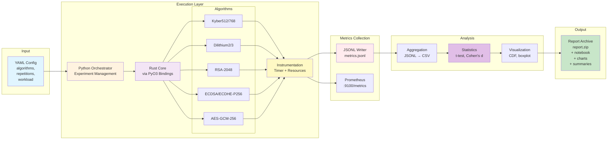

# Quick Reference: Framework Overview

This single-page reference provides a high-level overview of the PQC Performance Benchmarking Framework architecture.

---

## System Architecture at a Glance



---

## Key Components

| Component | Technology | Purpose | Key Files |
|-----------|-----------|---------|-----------|
| **Config Loader** | Python + YAML | Parse experiment parameters | `config_loader.py`, `default.yaml` |
| **Orchestrator** | Python 3.11+ | Manage execution workflow | `runner.py`, `cli.py` |
| **Crypto Adapters** | Rust (trait-based) | Implement algorithms | `adapters/*.rs`, `lib.rs` |
| **Instrumentation** | Rust + libc | Capture metrics | `InstrumentedAdapter`, `sample_resources()` |
| **Metrics Sink** | JSONL + Prometheus | Store measurements | `metrics.rs`, `JsonLineCollector` |
| **Aggregator** | Python + pandas | JSONL → CSV transformation | `metrics.py` |
| **Statistics** | Python + scipy | Hypothesis testing | `statistical_tests.py` |
| **Visualization** | matplotlib/seaborn | Generate charts | `reporting.py` |
| **Report** | ZIP archive | Package all artifacts | `report.zip` |

---

## Data Flow Summary

```
1. LOAD CONFIG
   └─> algorithms: [Kyber512, Dilithium2, RSA-2048, ...]
   └─> repetitions: 30
   └─> workload: TPS, duration, chunk_size

2. INITIALIZE ADAPTERS
   └─> Python imports Rust module via PyO3
   └─> Select requested algorithms

3. EXECUTE BENCHMARK
   └─> For each algorithm:
       └─> For each operation (keygen, sign, encapsulate, ...):
           └─> Start timer
           └─> Execute operation
           └─> Stop timer, sample resources (CPU, memory, I/O)
           └─> Emit metrics (JSONL + Prometheus)

4. AGGREGATE METRICS
   └─> Read metrics.jsonl
   └─> Group by algorithm + operation
   └─> Calculate mean, median, std, percentiles
   └─> Write metrics.csv, raw_events.csv

5. STATISTICAL ANALYSIS
   └─> Compare PQC vs Classical (t-test, Mann-Whitney U)
   └─> Calculate effect sizes (Cohen's d)
   └─> Compute 95% confidence intervals
   └─> Write summary.csv/json/md

6. VISUALIZATION
   └─> Generate CDF plots (latency distributions)
   └─> Generate boxplots (throughput comparison)
   └─> Generate bar charts (CPU, memory usage)
   └─> Save as charts/*.png

7. PACKAGE REPORT
   └─> Create Jupyter notebook (analysis.ipynb)
   └─> Archive all outputs (report.zip)
   └─> Validate schema compliance (metrics_validation.json)
```

---

## Metrics Captured

| Metric | Unit | Source | Description |
|--------|------|--------|-------------|
| **latency_micros** | µs | `Instant::now()` | Operation execution time |
| **cpu_user_micros** | µs | `getrusage()` | User-space CPU time |
| **cpu_system_micros** | µs | `getrusage()` | Kernel-space CPU time |
| **max_rss_bytes** | bytes | `getrusage()` | Maximum resident set size (memory) |
| **disk_io_bytes** | bytes | `/proc/self/io` | Total read + write bytes |
| **net_tx_bytes** | bytes | `/proc/net/dev` | Total transmitted bytes |
| **net_rx_bytes** | bytes | `/proc/net/dev` | Total received bytes |
| **throughput_ops_per_sec** | ops/s | Calculated | 1,000,000 / latency_micros |
| **public_key_bytes** | bytes | Algorithm spec | Size of public key |
| **secret_key_bytes** | bytes | Algorithm spec | Size of secret key |
| **signature_bytes** | bytes | Algorithm spec | Size of signature |

---

## Algorithm Summary

| Algorithm | Type | Security Level | Key Sizes | Notes |
|-----------|------|----------------|-----------|-------|
| **Kyber512** | KEM | NIST Level 1 | pk: 800B, sk: 1632B | Lattice-based |
| **Kyber768** | KEM | NIST Level 3 | pk: 1184B, sk: 2400B | Lattice-based |
| **Dilithium2** | Signature | NIST Level 2 | pk: 1312B, sk: 2528B, sig: 2420B | Lattice-based |
| **Dilithium3** | Signature | NIST Level 3 | pk: 1952B, sk: 4000B, sig: 3293B | Lattice-based |
| **RSA-2048** | Signature | ~112-bit | pk: 294B, sk: 1192B, sig: 256B | Classical |
| **ECDSA-P256** | Signature | ~128-bit | pk: 65B, sk: 32B, sig: 72B | Classical |
| **ECDHE-P256** | Key Exchange | ~128-bit | pk: 65B, sk: 32B | Classical |
| **AES-GCM-256** | Symmetric | 256-bit | key: 32B | Baseline |

---

## Statistical Analysis Methods

| Method | Type | Purpose | Interpretation |
|--------|------|---------|----------------|
| **Independent t-test** | Parametric | Compare means | p < 0.05 → significant difference |
| **Mann-Whitney U** | Non-parametric | Compare distributions | Robust to non-normality |
| **Cohen's d** | Effect size | Practical significance | d > 0.8 → large effect |
| **95% CI** | Confidence interval | Uncertainty quantification | Range of plausible values |

---

## Sample Output Structure

```
results/
├── metrics.jsonl              # Raw events (1 line per operation)
├── metrics.csv                # Aggregated data (algorithm × operation)
├── raw_events.csv             # Schema-aligned events
├── summary.csv                # Statistical summary (mean, std, p95, etc.)
├── summary.json               # Summary in JSON format
├── summary.md                 # Human-readable summary
├── charts/
│   ├── latency_cdf_Keygen.png
│   ├── latency_cdf_Encapsulate.png
│   ├── latency_cdf_Sign.png
│   ├── throughput_boxplot.png
│   ├── cpu_user_mean.png
│   ├── cpu_system_mean.png
│   └── memory_rss_mean.png
├── analysis.ipynb             # Jupyter notebook with analysis
├── report.zip                 # Complete archive (all above files)
├── environment.json           # System snapshot (CPU, OS, versions)
└── metrics_validation.json    # Schema compliance report
```

---

## Quick Commands

```bash
# Build and install
cargo build --release --manifest-path src/rust_core/Cargo.toml
pip install -e src/python_orchestrator

# Run benchmark
pqc-orchestrator --config ./configs/default.yaml

# View results
cat results/summary.md
open results/charts/latency_cdf_Keygen.png
jupyter notebook results/analysis.ipynb

# Reproduce experiment
bash scripts/reproduce.sh --config ./configs/default.yaml --mode local

# Deploy to Kubernetes
bash scripts/run_local_k8s.sh --config ./configs/default.yaml

# Deploy to GCP
bash scripts/run_gcp.sh \
  --config ./configs/default.yaml \
  --project my-project \
  --region us-central1 \
  --cluster pqc-cluster \
  --bucket gs://my-bucket
```

---

## Key Design Decisions

1. **Rust for Performance-Critical Code**: Microsecond-precision timing, zero-cost abstractions
2. **Python for Orchestration**: Flexible experiment management, rich analysis ecosystem
3. **Trait-Based Adapter Pattern**: Uniform interface for heterogeneous algorithms
4. **Decorator Pattern for Instrumentation**: Transparent metrics capture without algorithm modifications
5. **JSONL for Raw Events**: Append-only, streaming-friendly, human-readable
6. **Prometheus for Real-Time Monitoring**: Industry-standard metrics format, Grafana integration
7. **Schema Validation**: Ensures data quality and reproducibility
8. **Containerization**: Docker + Kubernetes for portable, scalable deployment
9. **Statistical Rigor**: Both parametric and non-parametric tests, effect sizes, confidence intervals
10. **Reproducibility**: Deterministic RNG, environment snapshots, version pinning

---

## Important Notes

- **Platform**: Designed for Linux (uses `/proc` for resource sampling)
- **Timing Precision**: Microseconds (sufficient for 1+ µs operations)
- **Sample Sizes**: n=30-60 per operation (>80% power for d ≥ 0.5)
- **Placeholder Crypto**: Current implementations use simplified algorithms for deterministic benchmarking
- **Production Use**: Replace adapters with `liboqs` or equivalent for real deployments

---

## Further Reading

- **Detailed Diagrams**: `docs/framework_diagrams.md`
- **Implementation Guide**: `docs/implementation_guide.md`
- **Architecture**: `docs/architecture.md`
- **Methodology**: `docs/benchmark_methodology.md`
- **Reproducibility**: `docs/reproducibility.md`

---

**Framework Version**: 1.0  
**Last Updated**: November 10, 2024  
**License**: See LICENSE file

